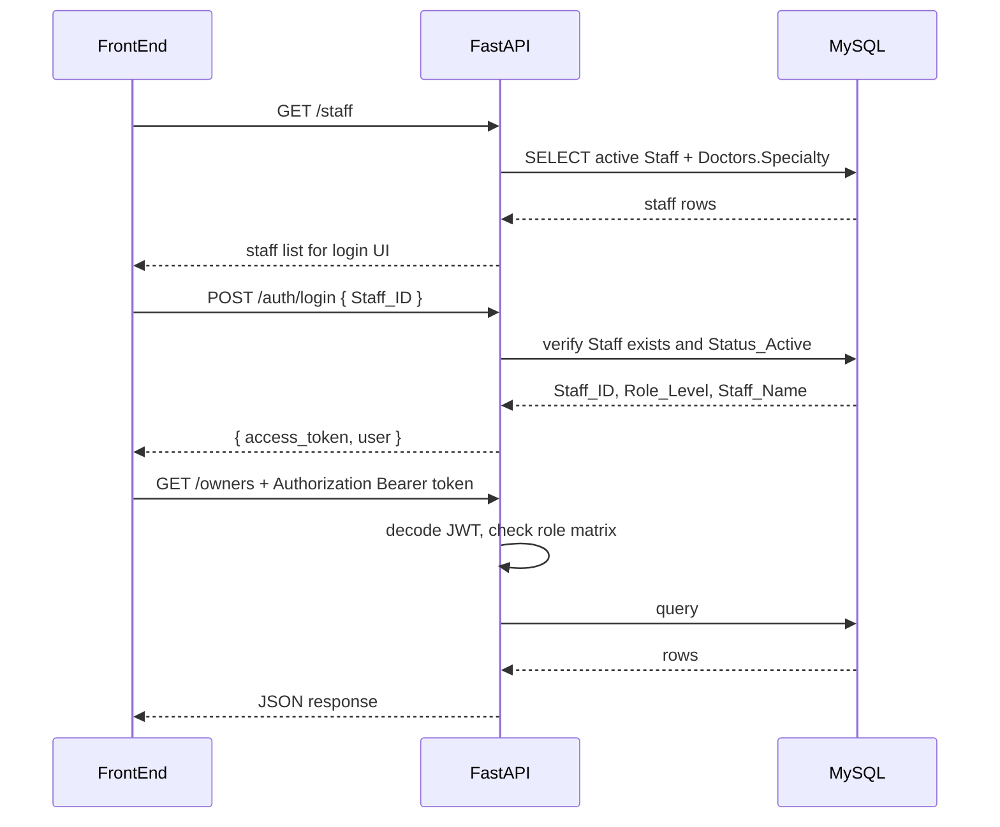

# Application Server — Pet Hospital API

FastAPI backend for the pet hospital front-end (`front-end/common.js`). All paths and JSON field names use **PascalCase** to match the database schema and mock API contract.

## Structure

```
application-server/
├── main.py              # FastAPI app entry point + CORS
├── db.py                # PyMySQL connection (reads .env)
├── auth.py              # Demo JWT create/decode
├── dependencies.py      # get_db(), get_current_user()
├── permissions.py       # require_roles() RBAC dependencies
├── errors.py            # MySQL exceptions → HTTP status codes
├── serialize.py         # Decimal / datetime / boolean → JSON-friendly values
├── helpers.py           # Appointment enrichment queries + slot constants
├── check_connection.py  # CLI + test helper: verify DB/schema readiness
├── requirements.txt
├── .env.example
├── tests/               # pytest API conformance tests
├── schemas/             # Pydantic request/response models
│   ├── owners.py
│   ├── pets.py
│   ├── appointments.py
│   ├── catalog.py
│   ├── records.py
│   └── invoices.py
└── routers/             # 23 business endpoints + auth
    ├── auth.py
    ├── owners.py
    ├── pets.py
    ├── doctors.py
    ├── schedule.py
    ├── appointments.py
    ├── catalog.py
    ├── records.py
    ├── invoices.py
    └── __init__.py      # api_router (aggregates all routers)
```

## Setup

1. Copy environment variables:

   ```bash
   cp .env.example .env
   ```

2. Fill in `DB_HOST`, `DB_PORT`, `DB_USER`, `DB_PASSWORD`, `DB_NAME`, and optionally `AUTH_SECRET` in `.env`.

3. Install dependencies:

   ```bash
   pip install -r requirements.txt
   ```

4. Verify database connectivity and schema readiness (optional):

   ```bash
   python check_connection.py
   ```

5. Ensure the database schema is loaded from `database/` (`tables.DDL`, `views.DDL`, `triggers.DDL`).

6. Load demo staff for login (idempotent):

   ```bash
   mysql -u ... -p ... < database/gen_mock_data.sql
   ```

## Authentication (demo JWT)

Login accepts `{ "Staff_ID": N }` only — **no password**. 

1. `GET /staff` — public staff picker for login UI
2. `POST /auth/login` — returns JWT + user profile
3. All business routes require `Authorization: Bearer <token>`

### Auth flow



| HTTP | Meaning |
|------|---------|
| 401 | Missing or invalid token |
| 403 | Valid token but insufficient role |

### Role levels

| `Role_Level` | Name | Primary modules |
|---:|---|---|
| 1 | 櫃檯行政 | 掛號、飼主、帳單收款 |
| 2 | 護理人員 | 病歷協助（medical write，不可 lock） |
| 3 | 獸醫師 | 病歷/處方、catalog 讀取、**lock 病歷** |
| 4 | 經理 | 目錄定價、管理；可 draft 病歷但不可 lock |

Roles 2 and 3 have **read-only** access to owner/pet mutations and invoice payment (GET allowed; POST/PATCH on those resources returns 403).

### Role matrix (complete)

Public routes (no token):

| Method | Path | Allowed |
|--------|------|---------|
| GET | `/staff` | Anyone |
| POST | `/auth/login` | Anyone |

Business routes — allowed `Role_Level` values per endpoint:

| Method | Path | 1 櫃檯 | 2 護理 | 3 獸醫 | 4 經理 |
|--------|------|:--:|:--:|:--:|:--:|
| GET | `/owners` | ✓ | ✓ | ✓ | ✓ |
| POST | `/owners` | ✓ | | | ✓ |
| PATCH | `/owners/{id}` | ✓ | | | ✓ |
| PATCH | `/owners/{id}/anonymize` | ✓ | | | ✓ |
| GET | `/pets?owner_id=` | ✓ | ✓ | ✓ | ✓ |
| POST | `/pets` | ✓ | | | ✓ |
| PATCH | `/pets/{id}` | ✓ | | | ✓ |
| GET | `/doctors` | ✓ | ✓ | ✓ | ✓ |
| GET | `/schedule?doctor_id=&date=` | ✓ | ✓ | ✓ | ✓ |
| POST | `/appointments` | ✓ | | | ✓ |
| GET | `/appointments/today` | ✓ | ✓ | ✓ | ✓ |
| GET | `/appointments?doctor_id=&date=` | ✓ | ✓ | ✓ | ✓ |
| PATCH | `/appointments/{id}/cancel` | ✓ | | | ✓ |
| GET | `/catalog` | ✓ | ✓ | ✓ | ✓ |
| GET | `/catalog/all` | | | | ✓ |
| PATCH | `/catalog/{id}` | | | | ✓ |
| POST | `/records` | | ✓ | ✓ | ✓ |
| POST | `/records/{id}/details` | | ✓ | ✓ | ✓ |
| DELETE | `/records/{id}/details/{detail_id}` | | ✓ | ✓ | ✓ |
| PATCH | `/records/{id}/draft` | | ✓ | ✓ | ✓ |
| PATCH | `/records/{id}/lock` | | | ✓ | |
| GET | `/invoices/pending` | ✓ | ✓ | ✓ | ✓ |
| PATCH | `/invoices/{id}/pay` | ✓ | | | ✓ |

Sensitive routes (called out in `TODO.md`): anonymize (1, 4), catalog pricing (4), record lock (3 only), invoice pay (1, 4).

Enforcement is in `permissions.py` via `require_roles()` on each router handler.

## Test

The conformance tests use `pytest` and FastAPI's in-process `TestClient` (which depends on `httpx`). They require a configured, reachable MySQL database with the schema loaded.

```bash
source .venv/bin/activate
python check_connection.py
python -m pytest tests/ -v
```

`check_connection.py` validates configuration, connectivity, core tables, and required views. The tests reuse the same readiness check via `db_readiness()` and skip only when the database is not ready.

When conformance + RBAC tests pass, the implementation matches `api_spec.md` including auth.

## Run

```bash
uvicorn main:app --host 127.0.0.1 --port 8000 --reload
```

- API base URL: `http://localhost:8000`
- Interactive docs: `http://localhost:8000/docs`
- OpenAPI schema: `http://localhost:8000/openapi.json`

## Connect the front-end

In `front-end/common.js`:

```js
const API_BASE = 'http://localhost:8000';
const USE_MOCK   = false;
```

Serve the HTML pages from any static file server or open them locally; CORS is enabled for all origins.

## API endpoints

### Auth (public)

| Method | Path | Description |
|--------|------|-------------|
| GET | `/staff` | Demo staff picker for login |
| POST | `/auth/login` | Demo login by `Staff_ID` → JWT |

### Business (requires Bearer token)

| Method | Path | Description |
|--------|------|-------------|
| GET | `/owners` | List non-anonymized owners with nested `pets[]` |
| POST | `/owners` | Create owner |
| PATCH | `/owners/{id}` | Partially update owner contact info |
| PATCH | `/owners/{id}/anonymize` | Anonymize owner PII |
| GET | `/pets?owner_id=` | List pets for an owner (uses `Pets` view, includes `Age`) |
| POST | `/pets` | Create pet |
| PATCH | `/pets/{id}` | Partially update pet info |
| GET | `/doctors` | List active veterinarians (`Role_Level = 3`) |
| GET | `/schedule?doctor_id=&date=` | Available time slots for a doctor on a date |
| POST | `/appointments` | Book appointment |
| GET | `/appointments/today` | Today's pending appointments (enriched) |
| GET | `/appointments?doctor_id=&date=` | Appointments for doctor/date (enriched) |
| PATCH | `/appointments/{id}/cancel` | Cancel appointment (`Appt_Status = 2`) |
| GET | `/catalog` | Active catalog items |
| GET | `/catalog/all` | All catalog items including discontinued |
| PATCH | `/catalog/{id}` | Update price or discontinue item |
| POST | `/records` | Create medical record + empty invoice |
| POST | `/records/{id}/details` | Add treatment detail |
| DELETE | `/records/{id}/details/{detail_id}` | Remove treatment detail |
| PATCH | `/records/{id}/draft` | Partially save clinical notes / diagnosis draft |
| PATCH | `/records/{id}/lock` | Partially update and lock record (trigger deducts stock), mark appointment done |
| GET | `/invoices/pending` | Unpaid invoices for locked records, including catalog item names |
| PATCH | `/invoices/{id}/pay` | Mark invoice paid (`Payment_Method`: `cash` / `card` / `insurance`) |

## Request / response conventions

- **Content-Type:** `application/json` on requests with a body.
- **Field names:** PascalCase matching DB columns (`Owner_ID`, `Scheduled_Time`, etc.).
- **Dates:** `Consultation_Date`, `Birth_Date` as `"YYYY-MM-DD"`.
- **Datetimes:** `Scheduled_Time` as `"YYYY-MM-DDTHH:MM:SS"`.
- **Decimals:** `Current_Price`, `Total_Billed`, `Historical_Price` returned as JSON numbers.
- **Booleans:** Known MySQL boolean columns are returned as JSON `true` / `false`.
- **PATCH bodies:** Partial PATCH routes update only fields present in the request body.
- **Auth:** Demo JWT via `POST /auth/login`; send `Authorization: Bearer <token>` on all business routes.

### Owner list response

`GET /owners` returns non-anonymized owners with nested pets from the `Pets` view:

```json
{
  "Owner_ID": 1,
  "Full_Name": "陳小明",
  "Phone_Number": "0912-345-678",
  "Email_Address": null,
  "Physical_Address": null,
  "Is_Anonymized": false,
  "pets": [
    {
      "Pet_ID": 1,
      "Owner_ID": 1,
      "Pet_Name": "小白",
      "Species_Type": "貓",
      "Breed_Name": "混種",
      "Birth_Date": "2024-03-10",
      "Current_Weight": 3.2,
      "Age": 2
    }
  ]
}
```

### Enriched appointment response

`GET /appointments/today` and `GET /appointments` return objects with nested `pet`, `owner`, and `doctor`:

```json
{
  "Appointment_ID": 1,
  "Pet_ID": 1,
  "Doc_Staff_ID": 1,
  "Scheduled_Time": "2026-06-13T09:00:00",
  "Appt_Status": 0,
  "pet": {
    "Pet_ID": 1,
    "Pet_Name": "小白",
    "Species_Type": "貓",
    "Birth_Date": "2024-03-10",
    "Current_Weight": 3.2
  },
  "owner": { "Owner_ID": 1, "Full_Name": "陳小明" },
  "doctor": { "Staff_ID": 1, "Staff_Name": "王大明", "Specialty": "一般內科" }
}
```

### Create appointment response

`POST /appointments` returns a flat appointment object only (no nested `pet` / `owner` / `doctor`):

```json
{
  "Appointment_ID": 10,
  "Pet_ID": 1,
  "Doc_Staff_ID": 1,
  "Scheduled_Time": "2026-06-13T10:00:00",
  "Appt_Status": 0
}
```

### Cancel appointment response

`PATCH /appointments/{id}/cancel` returns only:

```json
{
  "Appointment_ID": 1,
  "Appt_Status": 2
}
```

### Pending invoice response

`GET /invoices/pending` embeds related entities:

```json
{
  "Invoice_ID": 1,
  "Record_ID": 1,
  "Total_Billed": 1340.0,
  "Payment_Status": 0,
  "Payment_Method": null,
  "record": {
    "Record_ID": 1,
    "Consultation_Date": "2026-06-13",
    "Clinical_Notes": "食慾不振",
    "Final_Diagnosis": "急性上呼吸道感染",
    "Record_Locked": true,
    "details": [
      {
        "Detail_ID": 12,
        "Item_ID": 1,
        "Item_Name": "阿莫西林 250mg",
        "Numeric_Value": 2.0,
        "Historical_Price": 20.0
      }
    ]
  },
  "pet": { "Pet_ID": 1, "Pet_Name": "小白", "Species_Type": "貓" },
  "owner": { "Owner_ID": 1, "Full_Name": "陳小明" }
}
```

## Business rules

Rules enforced by the **database triggers** (not duplicated in Python):

| Rule | Trigger |
|------|---------|
| `Historical_Price` overwritten from catalog on insert | `trg_td_before_insert` |
| Block detail changes on locked records | `trg_td_before_*` |
| `Total_Billed` updated on detail insert/update/delete | `trg_td_after_*` |
| Drug stock deducted when record locked | `trg_mr_after_update` |
| Drug stock sufficiency before add detail / lock | `verify_drug_stock_for_*` in `helpers.py` |

Rules handled in **application code**:

| Rule | Where |
|------|-------|
| Create invoice when record is created | `POST /records` |
| Set `Appt_Status = 2` when record locked | `PATCH /records/{id}/lock` |
| Slot conflict check before booking | `POST /appointments` |
| Fixed busy slots per doctor | `GET /schedule` (`BUSY_SLOTS` in `helpers.py`) |
| Normalize validation errors to string `detail` | `main.py` exception handler |

## Error responses

| Condition | HTTP |
|-----------|------|
| Request validation error | 422 |
| Missing / invalid token | 401 |
| Insufficient role | 403 |
| Resource not found | 404 |
| Trigger rejection (locked record, etc.) | 400 |
| Duplicate phone / slot conflict | 409 |
| Other database errors | 500 |

Error body is always JSON with a string `detail`:

```json
{ "detail": "錯誤原因說明" }
```

## Enum reference

| Field | Values |
|-------|--------|
| `Appt_Status` | `0` pending, `1` in progress, `2` done/cancelled |
| `Payment_Status` | `0` unpaid, `1` paid, `2` voided |
| `Item_Category` | `1` drug, `2` lab, `3` treatment |
| `Payment_Method` | `cash`, `card`, `insurance` |

## Typical workflow

```
掛號預約 → 病歷/處方 → 帳單結算

POST /appointments
  → GET /appointments/today
  → POST /records
  → POST /records/{id}/details  (repeat)
  → PATCH /records/{id}/lock
  → GET /invoices/pending
  → PATCH /invoices/{id}/pay
```
