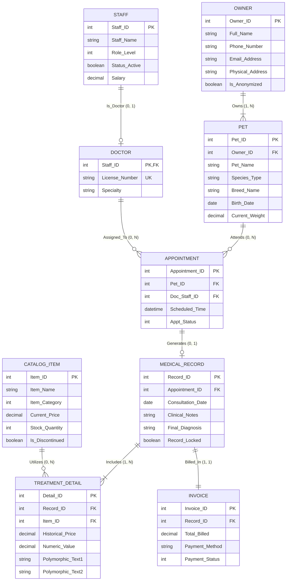

# 現代寵物醫院醫療與營運管理系統 (System Specification)

本文件整合了「現代寵物醫院醫療與營運管理系統」的需求、架構、資料庫設計與運作規則。

---

## 1. 專題動機與目標

隨著現代人飼養寵物的比例逐年攀升，寵物醫療與照護市場蓬勃發展，傳統依賴紙本或缺乏整合的單機版資訊系統，常面臨病患與飼主資料分散、病歷調閱耗時、庫存盤點不確實以及帳務漏算等挑戰。特別是在寵物醫療中，缺乏完善的關聯追蹤易發生病歷對應錯誤，或急診時重要藥品缺貨的嚴重風險。

本系統的目標為透過關聯式資料庫整合飼主、寵物、醫療排程、病歷、服務目錄與帳務資訊，其具體目標如下：
* 建立精確的飼主與寵物追蹤機制，確保病歷與帳單關聯的絕對正確性。
* 提供直覺的掛號與排程管理，避免醫師時間或診療資源的衝突。
* 整合醫療處置與庫存連動系統，開立處方時即時扣減實體庫存，防止「幽靈庫存」。
* 建立統一的「服務目錄」，支援醫療、檢驗與住宿等多型態計費項目。
* 集中管理帳務紀錄，提供精確的營收數據分析基礎與清晰的醫療明細。

---

## 2. 系統使用者與權限區分

為確保各模組間的資料安全與職責分離，系統設定三種核心使用者角色：

1.  **櫃檯與行政人員 (前端營運與帳務模組)**：
    * 權限：具備「飼主/寵物」資料與「預約排程」的新增、修改權限。針對「帳單」僅具讀取明細與更新付款狀態的權限，無法修改醫療收費項目。
    * 功能：協助掛號預約、處理就診後的批價與收銀台結帳作業。
2.  **獸醫師與醫療團隊 (核心醫療與庫存模組)**：
    * 權限：具備「病歷主檔」與「治療明細」的完全讀寫權限，以及「服務目錄」的庫存扣減權限。對「帳單」與「飼主」聯絡資訊僅唯讀。
    * 功能：撰寫當次看診病歷、開立處方或安排住院，並能即時查看藥局剩餘庫存。
3.  **診所經理與經營者 (後勤管理與分析模組)**：
    * 權限：最高層級的系統配置權限，包含「員工」建檔與「服務目錄」的定價、新增修改。對營運紀錄具統計分析權限，但不允許竄改已鎖定的歷史病歷。
    * 功能：查詢特定區間總營收、藥品消耗狀況與醫師看診量統計等。

---

## 3. 系統架構與業務流程

系統採用三層式架構設計 (Client 端、Application Server 端、Database 端)。

### 3.1 系統架構圖 (System Architecture)

```mermaid
graph TD
    subgraph ClientLayer [Client 層 (使用者端)]
        C1[櫃檯行政: 掛號 / 收款]
        C2[獸醫師: 病歷 / 開立處方]
        C3[診所經理: 報表 / 管理]
    end

    subgraph AppLayer [Application Server 層 (後端)]
        A1[Python + FastAPI: API服務/商業邏輯]
        A2[權限驗證: 角色/存取控制]
        A3[PyMySQL: 資料庫連線]
    end

    subgraph DBLayer [Database 層 (資料庫)]
        D1[MySQL: 資料儲存]
        D2[Triggers: 自動化商業規則]
        D3[Constraints: 資料完整性保護]
    end

    ClientLayer -- HTTP / HTTPS --> AppLayer
    AppLayer -- PyMySQL 連線 --> DBLayer

### 3.2 Core Workflows
系統涵蓋三大核心自動化流程，包含掛號預約、開立處方與庫存扣減，以及帳單自動結算

```mermaid
flowchart TD
    subgraph Process1 [流程一：掛號預約]
        direction TB
        S1([開始]) --> P1_1[行政人員輸入飼主/寵物資料]
        P1_1 --> P1_2[選擇醫師與預約時間]
        P1_2 --> P1_3{時段衝突?}
        P1_3 -- 是 --> P1_2
        P1_3 -- 否 --> P1_4[寫入 Appointments]
        P1_4 --> P1_5[狀態設為 已排程]
        P1_5 --> E1([結束])
    end

    subgraph Process2 [流程二：開立處方 + 庫存扣減]
        direction TB
        S2([開始]) --> P2_1[獸醫師選擇藥品項目]
        P2_1 --> P2_2[查詢 Stock_Quantity]
        P2_2 --> P2_3{庫存足夠?}
        P2_3 -- 否 --> E2_Error([庫存不足警示])
        P2_3 -- 是 --> P2_4[寫入 Treatment_Details]
        P2_4 --> P2_5[更新 Invoices.Total_Billed]
        P2_5 --> P2_6[病歷 Record_Locked = TRUE]
        P2_6 --> P2_7[扣減 Stock_Quantity]
        P2_7 --> E2([結束])
    end

    subgraph Process3 [流程三：帳單結算]
        direction TB
        S3([開始]) --> P3_1[病歷 Record_Locked = TRUE]
        P3_1 --> P3_2[帳單推送給櫃檯]
        P3_2 --> P3_3{完成付款?}
        P3_3 -- 否 --> P3_2
        P3_3 -- 是 --> P3_4[記錄 Payment_Method]
        P3_4 --> P3_5[Payment_Status = 1 已付清]
        P3_5 --> E3([結束])
    end
```

## 4. 資料庫概念設計 (Conceptual Database Design)
本系統規劃 8 個核心實體，確保「醫療行為」與「計費基礎」的準確對應。
---

### 4.1 實體與關聯 (Entities and Relationships)
Doctor 和 Staff 之間的關係從 Is_A 改為 Is_Doctor，以區分不同權限等級。同時移除了 Doctor 自身的 Primary Key，改為繼承 Staff 的 Staff_ID。



### 4.2 多型態資料記錄 (Polymorphic Data)
「治療明細 (Treatment Detail)」作為關聯實體，具備多型 (Polymorphic) 的資料對應特性：
。  藥品類 (Category=1)：Numeric_Value 代表「開立數量」，Polymorphic_Text1 詮釋為「用藥指示」
。  檢驗項目 (Category=2)：重點轉向 Polymorphic_Text2，記錄長篇文字的「檢驗數值與結果」
。  住宿/服務 (Category=3)：Numeric_Value 轉化為「入住天數」，Polymorphic_Text1 記錄「房號」

## 5 實體資料庫設計與 DDL (Physical Schema)
以下為根據 Report 3 所設計的 Relational Tables (DDL) 與 Triggers 實作，已拆分至 `database/` 目錄。

執行順序：先依外鍵依賴建立資料表，再建立 View，最後建立 Trigger。可從 `database/` 目錄執行 `SOURCE init.sql;` 一次載入全部物件。

```
database/
├── init.sql        # SOURCE tables.DDL → views.DDL → triggers.DDL
├── tables.DDL      # all 9 tables
├── views.DDL       # Pets view
└── triggers.DDL    # all triggers
```

### 5.1 Tables (Relations)

`database/tables.DDL` — Owners, PetBase, Staff, Doctors, Catalog_Items, Appointments, Medical_Records, Treatment_Details, Invoices

### 5.2 Views

`database/views.DDL` — Pets

### 5.3 Trigger

`database/triggers.DDL` — trg_td_* (Treatment_Details), trg_mr_after_update (Medical_Records)

## 6. 系統運作規則與限制 (Rules & Constraints)

為合規與保護歷史資料，系統具備嚴格的資料處理機制：

1. **歷史定價保護 (Historical Price Protection)**：透過 `trg_td_before_insert` 觸發器，寫入時自動複製服務目錄當下單價至明細表中。限制關聯查詢不能依賴目錄表計算歷史帳單，以防未來定價調漲影響過去紀錄。


2. **醫療狀態鎖定 (Record Locking)**：當獸醫師標記病歷「完成看診」(Record_Locked = TRUE) 時，系統將凍結下層明細的修改權限，並自動執行實體庫存扣減。


3. **禁止物理刪除 (No Physical Delete)**：為符合醫療糾紛究責與稅務法規，產生關聯交易的數據皆禁止硬刪除，停產藥品或離職員工僅能標記為停用 (Inactive) 以隱藏於前端選單。


4. **隱私權與匿名化例外處理 (Anonymization)**：若飼主要求刪除個資且已存在醫療紀錄，系統會啟動腳本將個人識別資訊 (PII) 如電話、地址清空，並將姓名覆寫為 "Deleted User"，確保隱私合規並完整保留醫院營收統計。
